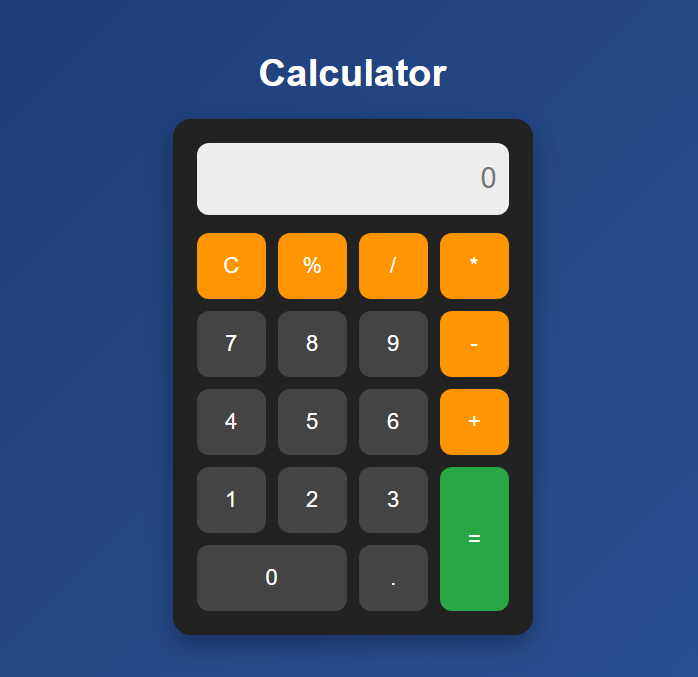

# Calculator

A simple and interactive **Calculator** built using HTML, CSS, and JavaScript. This project allows users to perform basic arithmetic operations like addition, subtraction, multiplication, and division with a clean and user-friendly interface.

## Features

- Perform basic arithmetic operations:
  - Addition (`+`)
  - Subtraction (`-`)
  - Multiplication (`*`)
  - Division (`/`)
- Clear (`C`) button to reset the input
- Responsive design for both desktop and mobile devices
- Interactive and intuitive UI

## Screenshots

  


## Installation

1. Clone this repository:
   ```bash
   git clone https://github.com/Shrabani-Mishra/Calculator-Web-Application.git
